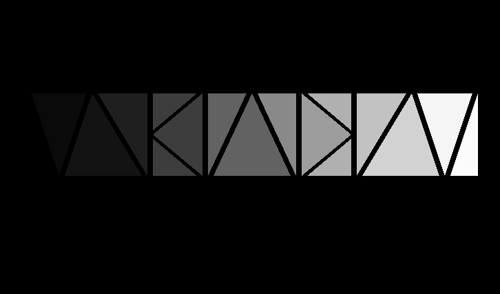

# OpenGL Learning Project

Working through [LearnOpenGL](https://learnopengl.com/). This repo tracks my progress learning OpenGL!

## Chapters finished:
1 through 5 :)

## Dependencies
- GLFW 3.x
- GLAD
- CMake
- MSVC 2022

## Build Instructions
1. Clone the repo
2. Open `OpenGL_Test.sln` in Visual Studio/Rider
3. Build and run (F5)

Libraries are included in the `lib/` directory

## Screenshots
Made some cool triangles after getting inspired by comments in the Shaders chapter:

